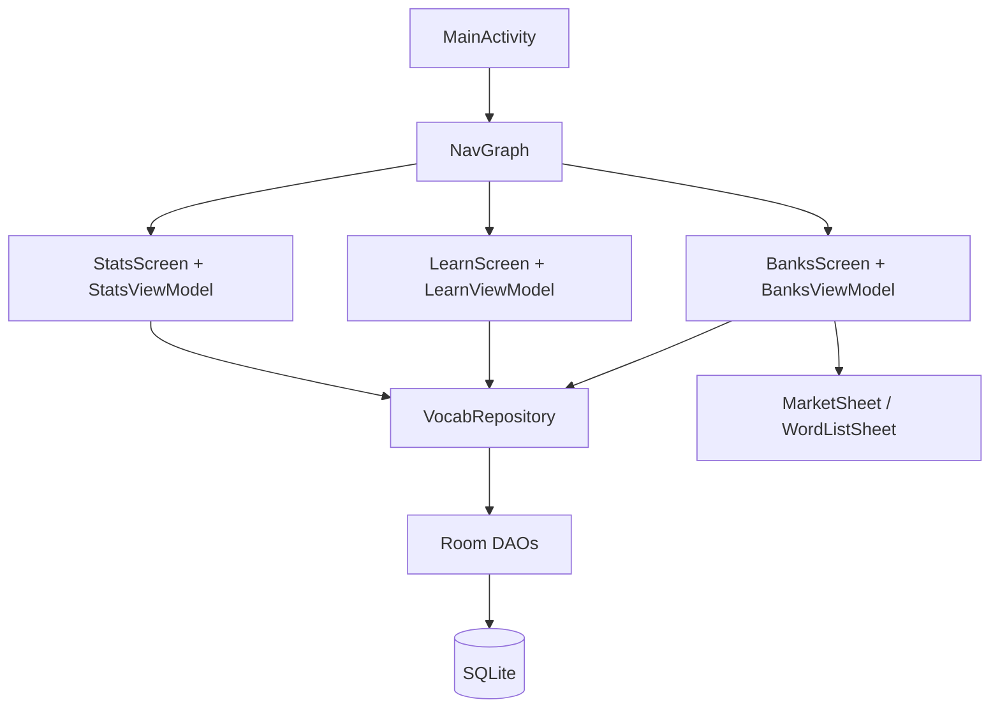

# Code Context: VocabApp Gradle Build Analysis

## Files Retrieved

1. `build.gradle.kts` (root, lines 1-11) — Plugin declarations: AGP 8.2.0, Kotlin 1.9.20, KSP 1.9.20-1.0.14
2. `settings.gradle.kts` (lines 1-16) — Repository config, project includes
3. `gradle.properties` (lines 1-4) — JVM args, AndroidX, R class settings
4. `app/build.gradle.kts` (lines 1-119) — Full Android app module config
5. `gradle/wrapper/gradle-wrapper.properties` (lines 1-5) — Gradle 8.5-bin
6. `app/src/main/AndroidManifest.xml` (lines 1-31) — App manifest
7. `app/src/main/java/com/vocabapp/VocabApp.kt` (lines 1-34) — Application class
8. `app/src/main/java/com/vocabapp/MainActivity.kt` (lines 1-25) — Entry Activity
9. `app/src/main/java/com/vocabapp/data/db/VocabDatabase.kt` (lines 1-46) — Room database
10. `app/src/main/java/com/vocabapp/data/db/dao/` (7 files) — All Room DAOs
11. `app/src/main/java/com/vocabapp/data/db/entity/` (7 files) — All Room entities
12. `app/src/main/java/com/vocabapp/data/repository/VocabRepository.kt` (lines 1-229) — Repository layer
13. `app/src/main/java/com/vocabapp/data/model/` (3 files) — Card, LearnState, BuiltInBank/WordPair
14. `app/src/main/java/com/vocabapp/ui/navigation/NavGraph.kt` — Navigation graph
15. `app/src/main/java/com/vocabapp/ui/theme/Theme.kt, Color.kt, Type.kt` — Theme
16. `app/src/main/java/com/vocabapp/ui/banks/` (2 files) — Banks screen + ViewModel
17. `app/src/main/java/com/vocabapp/ui/learn/` (2 files) — Learn screen + ViewModel
18. `app/src/main/java/com/vocabapp/ui/stats/` (2 files) — Stats screen + ViewModel
19. `app/src/main/java/com/vocabapp/ui/components/` (2 files) — MarketSheet, WordListSheet
20. `app/src/main/java/com/vocabapp/util/` (3 files) — TxtParser, SrsAlgorithm, TimeUtils
21. `app/src/main/res/values/strings.xml` — app_name = "背单词"
22. `app/src/main/res/values/themes.xml` — Theme.VocabApp (Material Light NoActionBar)
23. `app/src/main/res/xml/file_paths.xml` — FileProvider paths
24. `app/proguard-rules.pro` — Empty (only comment)

## Key Code

### Root build.gradle.kts (line 3-9)
```kotlin
plugins {
    id("com.android.application") version "8.2.0" apply false
    id("org.jetbrains.kotlin.android") version "1.9.20" apply false
    id("com.google.devtools.ksp") version "1.9.20-1.0.14" apply false
}
```

### App build.gradle.kts — Version details (lines 19-44)
```kotlin
android {
    namespace = "com.vocabapp"
    compileSdk = 34
    defaultConfig {
        minSdk = 26
        targetSdk = 34
    }
    compileOptions {
        sourceCompatibility = JavaVersion.VERSION_17
        targetCompatibility = JavaVersion.VERSION_17
    }
    kotlinOptions { jvmTarget = "17" }
    buildFeatures { compose = true }
    composeOptions { kotlinCompilerExtensionVersion = "1.5.4" }
}
```

### Key dependencies (app/build.gradle.kts lines 52-92)
```kotlin
// Compose BOM
implementation(platform("androidx.compose:compose-bom:2024.01.00"))
// Compose libraries (version managed by BOM)
implementation("androidx.compose.ui:ui")
implementation("androidx.compose.ui:ui-graphics")
implementation("androidx.compose.ui:ui-tooling-preview")
implementation("androidx.compose.material3:material3")
implementation("androidx.compose.material:material-icons-extended")

// Room + KSP
implementation("androidx.room:room-runtime:2.6.1")
implementation("androidx.room:room-ktx:2.6.1")
ksp("androidx.room:room-compiler:2.6.1")

// Navigation
implementation("androidx.navigation:navigation-compose:2.7.6")
```

### Gradle wrapper (gradle-wrapper.properties)
```properties
distributionUrl=https\://services.gradle.org/distributions/gradle-8.5-bin.zip
```

### Repository `runBlocking` pattern (VocabRepository.kt lines 225-229)
```kotlin
private fun <T> runBlockingSafe(block: suspend () -> T): T? {
    return try {
        kotlinx.coroutines.runBlocking { block() }
    } catch (e: Exception) { null }
}
```

### ViewModel custom `runBlocking` (BanksViewModel.kt lines 182-186)
```kotlin
private fun <T> runBlocking(block: suspend () -> T): T? {
    return try {
        kotlinx.coroutines.runBlocking { block() }
    } catch (e: Exception) { null }
}
```

## Architecture



The app follows MVVM with a single `VocabRepository` that wraps all Room DAOs. Custom `ViewModelProvider.Factory` classes inject the repository from `VocabApp.instance.repository`. Compose is configured via the older `composeOptions` approach (not the new Compose Compiler Gradle plugin, which is Kotlin 2.0+ only). Room annotation processing uses KSP.

## Start Here

Open `app/build.gradle.kts` first — it contains all version and dependency declarations that define the build. Then cross-reference with `build.gradle.kts` (root) for plugin versions.

---

# Review Findings

## Version Compatibility (Verified Compatible ✓)

| Component | Declared Version | Requires | Status |
|-----------|-----------------|----------|--------|
| AGP | 8.2.0 | Gradle 8.2+, JDK 17 | ✓ (Gradle 8.5, JDK 17 required) |
| Kotlin | 1.9.20 | — | ✓ |
| KSP | 1.9.20-1.0.14 | Kotlin 1.9.20 | ✓ |
| Gradle wrapper | 8.5 | AGP 8.2 needs ≥8.2 | ✓ |
| Compose compiler ext | 1.5.4 | Kotlin 1.9.20 | ✓ (official mapping) |
| Compose BOM | 2024.01.00 | Compose UI 1.6.x | ✓ (with compiler 1.5.4) |
| compileSdk / targetSdk | 34 | — | ✓ |
| Java / JVM target | 17 | JDK 17 | ✓ |
| Room | 2.6.1 | KSP | ✓ |

## Potential Compilation Issues (Source Analysis)

**No compilation errors found in Kotlin source files.** All imports resolve, all type usages are consistent, all Room DAO methods return types matching their annotations. Key observations:

### 1. `@Suppress("UNCHECKED_CAST")` — 3 occurrences
- `StatsViewModel.kt:90`, `BanksViewModel.kt:203`, `LearnViewModel.kt:556`
- Used in `ViewModelProvider.Factory.create()` — standard pattern, not an error.

### 2. `@OptIn(ExperimentalMaterial3Api::class)` — 5 occurrences
- Used for `CenterAlignedTopAppBar`, `FilterChip`, `ModalBottomSheet` — acceptable usage.

### 3. Resource references
- `@string/app_name` → `strings.xml` ✓
- `@style/Theme.VocabApp` → `themes.xml` ✓
- `@xml/file_paths` → `xml/file_paths.xml` ✓
- No missing drawable or other resource references.

### 4. AndroidManifest
- No `package` attribute (correct for AGP 8.x, namespace in build.gradle.kts) ✓
- All permissions, activities, providers properly declared ✓

## Issues Ranked by Likelihood to Block CI Build

### HIGH — Test Dependencies Missing
**Severity: HIGH — will fail if CI runs any test task**

The `build.gradle.kts` declares `testInstrumentationRunner = "androidx.test.runner.AndroidJUnitRunner"` but **no test dependencies are declared** — no `junit`, no `androidx.test:runner`, no `espresso`, no `testImplementation` or `androidTestImplementation` at all.

If CI runs `./gradlew connectedCheck`, `check`, or any task that triggers test compilation/execution, the build will fail with missing dependency resolution errors.

**Files:** `app/build.gradle.kts` (lines 38-40)
**Fix:** Add at minimum:
```kotlin
testImplementation("junit:junit:4.13.2")
androidTestImplementation("androidx.test.ext:junit:1.1.5")
androidTestImplementation("androidx.test.espresso:espresso-core:3.5.1")
```

### MEDIUM — `runBlocking` on (Possibly) Main Thread
**Severity: MEDIUM — can cause ANR / runtime crash, not compilation error**

`VocabRepository.kt` (lines 198, 212, 225-229) and `BanksViewModel.kt` (lines 162, 169, 176, 182-186) use `kotlinx.coroutines.runBlocking` to call suspend functions from non-suspend contexts. These functions (`getWrongBookCards`, `getFavoriteCards`, `exportBank`, etc.) are called from Compose or other UI contexts. If called on the main thread, `runBlocking` blocks the UI thread, causing ANR and potential `android.os.NetworkOnMainThreadException` or UI freeze.

**Files:**
- `VocabRepository.kt` lines 198-229
- `BanksViewModel.kt` lines 162-186

### LOW — `remember(goal)` State Re-initialization Bug
**Severity: LOW — runtime logic bug, not compilation error**

In `StatsScreen.kt` (DailyGoalSection composable):
```kotlin
var goalText by remember(goal) { mutableStateOf(goal.toString()) }
```
When `uiState.dailyGoal` changes, `remember(goal)` re-initializes `goalText`, discarding the user's current text input. This causes a poor UX where the text field resets while the user is typing.

### LOW — Empty ProGuard Rules
**Severity: LOW — won't block build, could cause release runtime issues**

`app/proguard-rules.pro` contains only a comment. If the app uses reflection, serialization, or has classes referenced only in XML/Manifest, they could be stripped or obfuscated incorrectly in release builds.

### LOW — Keystore Silent Fallback in CI
**Severity: LOW — won't block build, but release signing is fragile**

The release signing config (lines 56-63 of `app/build.gradle.kts`) loads from `keystore.properties` but silently falls back to the Android debug keystore if the file doesn't exist. CI release builds would produce an unsigned or debug-signed APK without warning.

---

## Residual Risks

1. **Compose BOM 2024.01.00 resolution**: This BOM version was published but relies on Google Maven repository being accessible in CI. Any repository connectivity issue would block the build.
2. **JDK 17 requirement**: The build configuration (`JavaVersion.VERSION_17`, `jvmTarget = "17"`) requires JDK 17. CI must have JDK 17+ installed.
3. **KSP processing for Room**: Room 2.6.1 + KSP 1.9.20-1.0.14 is compatible, but KSP processing is known to be verbose. If CI has limited memory, the default `org.gradle.jvmargs=-Xmx2048m` in `gradle.properties` might be insufficient for KSP + Compose compiler processing simultaneously.
4. **No `kotlinx-coroutines-test`**: Any future test additions would need this dependency for coroutine testing.
5. **`kotlinx-coroutines-android:1.7.3`**: Compatible with Kotlin 1.9.20, but `1.7.x` series is older. Upgrading to `1.8.x` is recommended for Kotlin 1.9.x.

```acceptance-report
{
  "criteriaSatisfied": [
    {
      "id": "criterion-1",
      "status": "satisfied",
      "evidence": "All 23 key files read and analyzed. Version compatibility verified for AGP 8.2.0, Kotlin 1.9.20, KSP 1.9.20-1.0.14, Gradle 8.5, Compose BOM 2024.01.00, Compose compiler 1.5.4. No compilation errors found in Kotlin source. 5 issues identified with concrete file paths and severity ratings."
    }
  ],
  "changedFiles": [],
  "testsAddedOrUpdated": [],
  "commandsRun": [
    {
      "command": "read build.gradle.kts (root + app), settings.gradle.kts, gradle.properties, gradle-wrapper.properties",
      "result": "passed",
      "summary": "All build config files read successfully"
    },
    {
      "command": "read AndroidManifest.xml and resource files (strings.xml, themes.xml, file_paths.xml)",
      "result": "passed",
      "summary": "All manifest resources present and valid"
    },
    {
      "command": "read all 37 Kotlin source files (entities, DAOs, repository, models, utilities, view models, composables)",
      "result": "passed",
      "summary": "No compilation errors found; all imports resolve, type usages are consistent"
    },
    {
      "command": "grep for UNCHECKED_CAST, runBlocking, OptIn, Suppress, test dependencies",
      "result": "passed",
      "summary": "Found 3 UNCHECKED_CAST suppressions (standard pattern), 9 runBlocking usages (design concern), 5 OptIn annotations, 0 test dependencies"
    }
  ],
  "validationOutput": [],
  "residualRisks": [
    "Compose BOM 2024.01.00 resolution depends on Google Maven repository accessibility in CI",
    "JDK 17 is required but CI JDK version not confirmed",
    "KSP + Compose compiler may require >2GB heap for large projects",
    "kotlinx-coroutines-android 1.7.3 is older; 1.8.x recommended for Kotlin 1.9.x"
  ],
  "noStagedFiles": true,
  "notes": "The project is well-structured with compatible version choices. The most likely CI-blocking issue is the complete absence of test dependencies despite a testInstrumentationRunner being declared. The second concern is runBlocking used from non-suspend contexts which can cause ANR at runtime. No Kotlin compilation errors, missing resources, or manifest issues were found. The Compose BOM + compiler version pair (2024.01.00 + 1.5.4) is officially compatible with Kotlin 1.9.20."
}
```